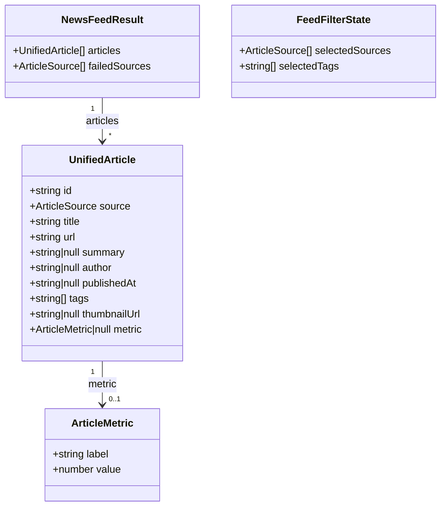

# Aggregated News Feed

**Status**: Draft
**Created**: 2026-09-16
**Author**: spec-writer agent
**Related Stories**: [docs/user-stories/aggregated-news-feed-user-story.md](../user-stories/aggregated-news-feed-user-story.md)

## Executive Summary

This spec covers the UI layer for the aggregated news feed: a lazy-loaded `NewsFeedComponent` (smart) backed by a new `NewsFeedStateService` that wraps the existing `NewsAggregatorService.fetchFeed()`, plus a presentational `ArticleCardComponent` and `FeedFiltersComponent`. All fetching, normalization, and merge/sort logic already exists (`NewsAggregatorService`, `ArticleNormalizerService`, the 5 fetcher services); this spec only adds client-side state (loading/error/filter signals) and rendering.

## Requirements Reference

**User Story**: See [User Story](../user-stories/aggregated-news-feed-user-story.md#user-story)

This specification focuses on the technical implementation details for the requirements defined in the user story.

## Technical Analysis

### Affected Areas

- **Models**: New `FeedLoadStatus` union type and `FeedFilterState` interface (client-side only — not persisted). No changes to `UnifiedArticle`/`ArticleMetric` (existing, [article.model.ts](../../src/app/models/article.model.ts)).
- **Data-access / State Services**: New `NewsFeedStateService` (`src/app/services/news-feed-state.service.ts`) — wraps [`NewsAggregatorService`](../../src/app/services/news-aggregator.service.ts), exposes signals for articles, loading, failed sources, and filters. No changes to `NewsAggregatorService`, `ArticleNormalizerService`, or the 5 fetcher services.
- **Components**: New standalone components — `NewsFeedComponent` (smart, routed), `ArticleCardComponent` (presentational), `FeedFiltersComponent` (presentational).
- **Routing**: New default route (`''`) in [app.routes.ts](../../src/app/app.routes.ts), lazy-loaded via `loadComponent`.
- **Forms**: None — filters are checkbox/toggle-style selections, not a reactive form.

### Feature Boundary Considerations

- `NewsAggregatorService`, `ArticleNormalizerService`, the 5 fetcher services, `UnifiedArticle`/`ArticleMetric`, and `DEVTO_TAGS`/`MSLEARN_TOPICS` are **Core** (already implemented, shared, `providedIn: 'root'`).
- `NewsFeedStateService`, `NewsFeedComponent`, `ArticleCardComponent`, and `FeedFiltersComponent` are scoped to a new `src/app/features/news-feed/` feature folder and form a new lazy-loading boundary at the app's default route.
- **Favoriting integration point only**: `ArticleCardComponent` exposes an `isFavorite` input and a `favoriteToggled` output. The Favorites storage mechanism (Dexie.js, per global engineering rules) is **out of scope** for this spec and will be delivered as a separate user story/spec that supplies the actual `isFavorite` value and handles the `favoriteToggled` event.
- **[NEEDS CLARIFICATION] Known data limitation**: `ArticleNormalizerService.normalizeMsLearn` and `normalizeHashnode` currently always set `tags: []`. Per AND-combined filter semantics (see [Client Data & State Architecture](#4-client-data--state-architecture)), any active tag filter will exclude all Microsoft Learn and Hashnode articles, since an empty `tags` array can never match a selected tag. This is a pre-existing normalizer characteristic, not introduced by this spec — flagging for a follow-up spec to populate `tags` for these two sources (e.g., mslearn: derive from the matched `MSLEARN_TOPICS` entry; hashnode: record the tag slug used in the per-tag GraphQL query). Until resolved, tag filtering is fully reliable only for `devto`, `hackernews`, and `github` articles.

### Security Considerations

- The feed is publicly accessible; no auth guard is required on the route (per AC: "No user credentials or account data are required to view the feed").
- Article `title`, `summary`, `author`, and `tags` from all 5 sources are untrusted external input. `ArticleCardComponent`'s template must render them via standard Angular interpolation (`{{ }}`) only — never `[innerHTML]` or `bypassSecurityTrustHtml`/`bypassSecurityTrustUrl`. Angular's default sanitization prevents script injection through interpolation.
- `thumbnailUrl` is bound to a native `src`/`NgOptimizedImage` `ngSrc` attribute, which Angular sanitizes via its built-in `SecurityContext.URL` sanitizer (strips `javascript:` URLs); no custom sanitization needed.
- `url` (article link) is rendered as an `<a href>` with `rel="noopener noreferrer" target="_blank"` to avoid reverse-tabnabbing when opening third-party links.
- No API keys/secrets are introduced by this spec; the existing fetcher services already call public, unauthenticated third-party APIs directly from the browser.

### Performance & Green Code Considerations

- **Bundle**: `news-feed` feature is lazy-loaded via `loadComponent` even though it sits behind the default route (`''`), keeping the initial app-shell bundle minimal. Feature budget: lazy chunk ≤ 300KB uncompressed (enforced via `angular.json` budgets).
- **Network**: `NewsFeedComponent` triggers exactly one call to `NewsFeedStateService.loadFeed()` per page load/reload (which internally fans out to the existing per-source fetchers via `forkJoin` — that fan-out count is unchanged, existing behavior). Filtering is 100% client-side (`computed()` signals) — selecting/clearing source or tag filters never issues a new HTTP request.
- **Rendering**: `@for` over the filtered article list uses `track article.id`. Given up to ~140 merged articles are possible across all 5 sources' bounded per-request page sizes, the list is rendered inside a `cdk-virtual-scroll-viewport` once the filtered set exceeds 50 items, per green-code list-rendering guidance.
- **Deferred loading**: `FeedFiltersComponent` (filter chips UI) is wrapped in `@defer (on viewport)` since it is not needed for first paint of the article list.
- All new components use `OnPush` change detection and signal-based `input()`/`output()`.

## API Contract

There is no first-party backend for this feature — the Angular client calls 5 public third-party APIs directly, exclusively through the existing fetcher services under `src/app/services/fetchers/`. This spec does not redesign these contracts; they are summarized below for reference only.

| Source | Fetcher | Endpoint | Method | Key params | Raw response type |
|---|---|---|---|---|---|
| Dev.to | [devto-fetcher.service.ts](../../src/app/services/fetchers/devto-fetcher.service.ts) | `https://dev.to/api/articles` | GET (one request per `DEVTO_TAGS` entry) | `tag`, `per_page=20` | `DevToArticle[]` |
| Microsoft Learn | [mslearn-fetcher.service.ts](../../src/app/services/fetchers/mslearn-fetcher.service.ts) | `https://learn.microsoft.com/api/catalog` | GET (single request) | `locale=en-us` | `MsLearnCatalogEntry[]` (filtered client-side by `MSLEARN_TOPICS`) |
| Hacker News | [hackernews-fetcher.service.ts](../../src/app/services/fetchers/hackernews-fetcher.service.ts) | `https://hn.algolia.com/api/v1/search` | GET (one request per `DEVTO_TAGS` entry) | `query`, `tags=story`, `hitsPerPage=20` | `HackerNewsHit[]` |
| Hashnode | [hashnode-fetcher.service.ts](../../src/app/services/fetchers/hashnode-fetcher.service.ts) | `https://gql.hashnode.com/` | POST (GraphQL; one request per `DEVTO_TAGS` slug) | `PostsByTag` query, `slug` variable | `HashnodePost[]` |
| GitHub | [github-fetcher.service.ts](../../src/app/services/fetchers/github-fetcher.service.ts) | `https://api.github.com/search/repositories` | GET (single request) | `q=topic:<tag> OR ...`, `sort=stars`, `order=desc`, `per_page=30` | `GitHubRepo[]` |

All 5 raw response types above are normalized to `UnifiedArticle` by `ArticleNormalizerService` (existing — see field mappings in [article-normalizer.service.ts](../../src/app/services/article-normalizer.service.ts)). `NewsFeedStateService` (new, this spec) consumes only `NewsAggregatorService.fetchFeed(): Observable<NewsFeedResult>` and never calls a fetcher or the normalizer directly.

**Error surface for the UI layer**: `NewsFeedResult.failedSources: ArticleSource[]` is the sole error signal the UI needs to consume — HTTP status codes and retry/backoff for individual source calls are already handled inside `NewsAggregatorService` via `catchError`. This spec's components only branch on: `failedSources.length === 0` (no errors), `0 < failedSources.length < 5` (partial degradation), and `failedSources.length === 5` (full failure — note this can occur even if `articles.length > 0` is impossible in that case, since all 5 sources contributed 0 articles).

## Client Data & State Architecture



`FeedFilterState` and `FeedLoadStatus` are new client-only types (not sent to/received from any API):

```ts
// src/app/models/feed-filter-state.model.ts
export type FeedLoadStatus = 'idle' | 'loading' | 'loaded';

export interface FeedFilterState {
  selectedSources: ArticleSource[];
  selectedTags: string[];
}
```

### NewsFeedStateService State

New service, `src/app/services/news-feed-state.service.ts`, wraps `NewsAggregatorService` (existing, injected as-is). Mutable signals are private; only `readonly`/`computed` signals and action methods are exposed.

| Signal / Method | Type | Description |
|---|---|---|
| `articles` | `Signal<UnifiedArticle[]>` | All articles from the last completed `fetchFeed()` call, unfiltered |
| `status` | `Signal<FeedLoadStatus>` | `'idle'` before first load, `'loading'` while a fetch is in flight, `'loaded'` once it settles (success or failure) |
| `failedSources` | `Signal<ArticleSource[]>` | Sources that failed on the last fetch (empty array = no failures) |
| `isFullFailure` | `Signal<boolean>` (computed) | `true` when `failedSources().length === 5` |
| `isPartialFailure` | `Signal<boolean>` (computed) | `true` when `0 < failedSources().length < 5` |
| `selectedSources` | `Signal<ArticleSource[]>` | Active source filter selections; empty = "all sources" |
| `selectedTags` | `Signal<string[]>` | Active tag filter selections; empty = "all tags" |
| `filteredArticles` | `Signal<UnifiedArticle[]>` (computed) | `articles()` filtered by `selectedSources` AND `selectedTags` (see rule below) |
| `availableSources` | `readonly ArticleSource[]` (constant) | `['devto', 'mslearn', 'hackernews', 'hashnode', 'github']` |
| `availableTags` | `readonly string[]` (constant) | `[...DEVTO_TAGS, ...MSLEARN_TOPICS]` (existing constants from [topic-tags.ts](../../src/app/data/topic-tags.ts)), lowercased for matching |
| `loadFeed(): void` | method | Calls `NewsAggregatorService.fetchFeed()`, sets `status` to `'loading'`, then updates `articles`/`failedSources`/`status` on completion. Also used for the initial load. |
| `retry(): void` | method | Alias for `loadFeed()` — always re-fetches all 5 sources fresh, per AC ("Retrying ... does not reuse any previously failed or partial results") |
| `toggleSourceFilter(source: ArticleSource): void` | method | Adds/removes a source from `selectedSources` |
| `toggleTagFilter(tag: string): void` | method | Adds/removes a tag from `selectedTags` |
| `clearFilters(): void` | method | Resets both `selectedSources` and `selectedTags` to `[]` |

**Filter combination rule** (implements AC "Source and tag filters can be applied simultaneously and combine as a logical AND", and "selecting zero sources is treated as all sources"):

```ts
matches(article) =
  (selectedSources.length === 0 || selectedSources.includes(article.source)) &&
  (selectedTags.length === 0 || selectedTags.some(t => article.tags.includes(t.toLowerCase())));
```

An empty `selectedSources`/`selectedTags` array is treated as "no filter on that dimension" — this satisfies the AC without needing to block a zero-selection state.

#### Data & State Design Principles

- `articles`, `status`, `failedSources`, `selectedSources`, `selectedTags` are private `signal()`s inside `NewsFeedStateService`; only `.asReadonly()` versions and `computed()` values are exposed publicly.
- `ArticleSource` remains the existing string-literal union — no new enum introduced.
- No breaking changes to `UnifiedArticle`, `ArticleMetric`, `NewsFeedResult`, or `NewsAggregatorService`.

## Component Design

### Routing

**New Routes** (lazy-loaded):

1. `''` → `NewsFeedComponent` (via `loadComponent: () => import('./features/news-feed/news-feed.component').then(m => m.NewsFeedComponent)`)

**Navigation Updates**: None required — this is the app's landing route; no nav link changes needed for this spec.

### Component Breakdown

#### NewsFeedComponent (smart component)

**Location**: `src/app/features/news-feed/news-feed.component.ts`

**Purpose**: Load the feed on init, render loading/error/content states, and host the filters + article list.

**Change Detection**: `OnPush`

**State**: Injects `NewsFeedStateService`; calls `loadFeed()` once on construction (no manual subscription — the service updates its own signals). Reads `status`, `isFullFailure`, `isPartialFailure`, `failedSources`, `filteredArticles` directly in the template.

**Template states** (all mutually exclusive, driven by `status`/`isFullFailure`):

- `status() === 'loading'` → loading indicator (spinner + "Loading your feed…")
- `status() === 'loaded' && isFullFailure()` → full-feed error state: message ("Feed could not be loaded") + a retry button calling `retry()`
- `status() === 'loaded' && !isFullFailure()` → renders `FeedFiltersComponent`, then:
  - `isPartialFailure()` → a non-blocking, dismissible banner listing each failed source by name (e.g., "Hacker News is currently unavailable") above the list
  - `filteredArticles().length === 0` → empty state ("No articles match the selected filters" with a "Clear filters" action) — distinct from the full-failure state
  - otherwise → `@for (article of filteredArticles(); track article.id)` rendering `ArticleCardComponent`, wrapped in `cdk-virtual-scroll-viewport` when `filteredArticles().length > 50`

**Child Components**:
- `FeedFiltersComponent` (presentational, wrapped in `@defer (on viewport)`)
- `ArticleCardComponent` (presentational, one per article)

**User Interactions**:
- Click retry → `NewsFeedStateService.retry()`
- Click "Clear filters" → `NewsFeedStateService.clearFilters()`

#### ArticleCardComponent (presentational)

**Location**: `src/app/features/news-feed/article-card/article-card.component.ts`

**Purpose**: Render a single `UnifiedArticle` and surface the favorite-toggle affordance.

**Change Detection**: `OnPush`

**Inputs** (signal-based):
- `article = input.required<UnifiedArticle>()`
- `isFavorite = input<boolean>(false)` — favorites integration point only; actual favorited state is supplied by the parent (backed by a future Dexie-based Favorites feature, out of scope here)

**Outputs** (signal-based):
- `favoriteToggled = output<UnifiedArticle>()` — emits the article when the user clicks the favorite toggle; consuming/persisting this event is out of scope for this spec

**Template rules**:
- Always shows `title`, a source badge (mapped from `ArticleSource` to a display label, e.g. `devto` → "Dev.to"), and `summary` when non-null
- Shows `metric.label`/`metric.value` only when `metric !== null` (per AC: MS Learn/Hashnode show no metric row at all, never a placeholder/zero)
- Shows a formatted `publishedAt` date only when `publishedAt !== null`; the date field is omitted entirely otherwise (never renders "Invalid Date" or an epoch placeholder)
- Renders `thumbnailUrl` via `NgOptimizedImage` when non-null; omits the image element otherwise
- Article title/link uses `<a [href]="article().url" target="_blank" rel="noopener noreferrer">`
- Favorite toggle is an icon-only button with `aria-pressed="isFavorite()"` and `aria-label` reflecting current state (e.g., "Add to favorites"/"Remove from favorites")

#### FeedFiltersComponent (presentational)

**Location**: `src/app/features/news-feed/feed-filters/feed-filters.component.ts`

**Purpose**: Let the user select/clear source and tag filters.

**Change Detection**: `OnPush`

**Inputs** (signal-based):
- `availableSources = input.required<ArticleSource[]>()`
- `availableTags = input.required<string[]>()`
- `selectedSources = input.required<ArticleSource[]>()`
- `selectedTags = input.required<string[]>()`

**Outputs** (signal-based):
- `sourceToggled = output<ArticleSource>()`
- `tagToggled = output<string>()`
- `filtersCleared = output<void>()`

**Template**: Toggleable chip/checkbox group for sources (5 items) and one for tags (`DEVTO_TAGS` + `MSLEARN_TOPICS`, ~18 items); a visible "Clear filters" button always present, disabled when both selections are empty.

### Interaction Flows

#### Initial Load Flow
1. Router activates `NewsFeedComponent` for route `''`
2. `NewsFeedStateService.loadFeed()` is invoked; `status` → `'loading'`
3. `NewsAggregatorService.fetchFeed()` resolves; `articles`, `failedSources`, `status` (→ `'loaded'`) are updated
4. Template re-renders based on `isFullFailure()`/`isPartialFailure()`/`filteredArticles()`

#### Retry Flow (full failure)
1. User clicks the retry action in the full-feed error state
2. `NewsFeedStateService.retry()` calls `loadFeed()` again — all 5 sources are queried fresh (no reuse of prior `articles`/`failedSources`)
3. Template returns to the loading state, then re-evaluates per the Initial Load Flow

#### Filter Flow
1. User toggles a source chip or tag chip in `FeedFiltersComponent`
2. `sourceToggled`/`tagToggled` output fires → `NewsFeedComponent` (or the service directly, if `FeedFiltersComponent` injects the service — smart enough to skip prop-drilling) calls `toggleSourceFilter()`/`toggleTagFilter()`
3. `filteredArticles` computed signal re-evaluates; no HTTP request is made
4. User clicks "Clear filters" → `clearFilters()` resets both dimensions

#### Favorite Toggle Flow (integration point only)
1. User clicks the favorite icon on `ArticleCardComponent`
2. `favoriteToggled` output emits the `UnifiedArticle`
3. **[Out of scope]** A future Favorites feature (Dexie-backed, per a separate spec) will subscribe to this output and persist/toggle the favorite; this spec only defines the emission contract

### Accessibility Requirements

- Favorite toggle buttons are icon-only with `aria-label` + `aria-pressed` (see `ArticleCardComponent` above)
- Loading indicator and error banners are announced via `aria-live="polite"` (partial-failure banner) and `aria-live="assertive"` (full-failure state)
- All filter chips are keyboard-operable (`<button>` or `<input type="checkbox">` semantics, not `<div>` with click handlers)
- Retry and "Clear filters" buttons are reachable via keyboard and have visible focus states
- Article links have discernible accessible names (the article title, not just "Read more")

### Responsive Behavior

- Desktop (>1024px): 3-column article card grid
- Tablet (768–1024px): 2-column grid
- Mobile (<768px): single-column, stacked layout; filters collapse into a toggleable panel

### Performance & Green Code Budget (Angular 22)

- **Bundle budget**: `news-feed` lazy chunk ≤ 300KB uncompressed (enforced via `angular.json` budgets)
- **Change detection strategy**: `NewsFeedComponent`, `ArticleCardComponent`, `FeedFiltersComponent` all use `OnPush` and signal-based inputs/outputs
- **Network efficiency**: One `loadFeed()` call per page load/reload; all filtering is client-side with zero additional HTTP requests
- **Rendering strategy**: `@for` with `track article.id`; `cdk-virtual-scroll-viewport` required once `filteredArticles().length > 50`
- **Deferred loading**: `FeedFiltersComponent` wrapped in `@defer (on viewport)`
- **Asset optimization**: `thumbnailUrl` images rendered via `NgOptimizedImage` with explicit `width`/`height` to avoid layout shift; omitted entirely when `null`

## Testing Requirements

### Unit Test Scenarios

#### Models
- [ ] GivenFeedFilterState_WhenBothSelectionsEmpty_ThenRepresentsAllSourcesAndAllTags

#### Data-access / State Services (`NewsFeedStateService`)
- [ ] GivenService_WhenLoadFeedCalled_ThenStatusTransitionsLoadingThenLoaded (mocked `NewsAggregatorService.fetchFeed`)
- [ ] GivenService_WhenFetchFeedSucceedsForAllSources_ThenArticlesSignalPopulatedAndFailedSourcesEmpty (validates AC: Core Functionality — feed combines 5 sources)
- [ ] GivenService_WhenOneOfFiveSourcesFails_ThenFailedSourcesContainsThatSourceAndArticlesFromOthersArePresent (validates AC: Scenario 2 / Error Handling)
- [ ] GivenService_WhenAllFiveSourcesFail_ThenIsFullFailureIsTrueAndArticlesIsEmpty (validates AC: Scenario 3)
- [ ] GivenService_WhenRetryCalledAfterFullFailure_ThenFetchFeedIsInvokedAgainWithFreshResult (validates AC: Scenario 3 retry / Scenario 6)
- [ ] GivenService_WhenToggleSourceFilterCalledWithNoPriorSelection_ThenSelectedSourcesContainsOnlyThatSource
- [ ] GivenService_WhenToggleSourceFilterCalledTwiceWithSameSource_ThenSourceIsRemovedFromSelection
- [ ] GivenService_WhenNoSourcesSelected_ThenFilteredArticlesEqualsAllArticles (validates AC: Input Validation — zero-selection = all sources)
- [ ] GivenService_WhenSourceAndTagBothSelected_ThenFilteredArticlesMatchBothCriteria (validates AC: Scenario 5 — AND combination)
- [ ] GivenService_WhenClearFiltersCalled_ThenSelectedSourcesAndSelectedTagsAreEmpty
- [ ] GivenService_WhenLoadFeedCalled_ThenNewsAggregatorServiceFetchFeedIsCalledExactlyOnceAndNoDiskStorageIsRead (validates AC: no disk cache, Scenario 6)

#### Components
- [ ] GivenNewsFeedComponent_WhenStatusIsLoading_ThenLoadingIndicatorShown (validates AC: User Experience — loading indicator)
- [ ] GivenNewsFeedComponent_WhenIsFullFailureTrue_ThenFullErrorStateShownWithRetryButton (validates AC: Scenario 3)
- [ ] GivenNewsFeedComponent_WhenRetryClicked_ThenStateServiceRetryIsCalled
- [ ] GivenNewsFeedComponent_WhenIsPartialFailureTrue_ThenNonBlockingBannerShownAndArticleListStillRenders (validates AC: Scenario 2)
- [ ] GivenNewsFeedComponent_WhenFilteredArticlesEmptyButNotFullFailure_ThenEmptyFilterStateShownDistinctFromFullErrorState
- [ ] GivenNewsFeedComponent_WhenFilteredArticlesExceedFifty_ThenVirtualScrollViewportIsUsed
- [ ] GivenNewsFeedComponent_WhenListRendered_ThenTrackByUsesArticleId
- [ ] GivenArticleCardComponent_WhenMetricIsNull_ThenNoMetricRowRendered (validates AC: MS Learn/Hashnode no-metric rule)
- [ ] GivenArticleCardComponent_WhenPublishedAtIsNull_ThenNoDateFieldRenderedAndNoInvalidDateShown (validates AC: date omission rule)
- [ ] GivenArticleCardComponent_WhenTitleContainsHtmlLikeString_ThenRenderedAsTextNotInterpretedAsHtml (validates AC: Security — untrusted input rendered safely)
- [ ] GivenArticleCardComponent_WhenFavoriteButtonClicked_ThenFavoriteToggledOutputEmitsWithArticle
- [ ] GivenArticleCardComponent_WhenIsFavoriteTrue_ThenAriaPressedIsTrueAndLabelReflectsRemoveAction
- [ ] GivenFeedFiltersComponent_WhenSourceChipClicked_ThenSourceToggledOutputEmitsThatSource
- [ ] GivenFeedFiltersComponent_WhenTagChipClicked_ThenTagToggledOutputEmitsThatTag
- [ ] GivenFeedFiltersComponent_WhenClearFiltersClicked_ThenFiltersClearedOutputEmits
- [ ] GivenFeedFiltersComponent_WhenNoSelections_ThenClearFiltersButtonIsDisabled

#### Routing
- [ ] GivenAppRoutes_WhenNavigatingToRoot_ThenNewsFeedComponentIsLazilyLoadedWithoutAuthGuard (validates AC: Security & Access Control — no auth required)

**Coverage note**: Every acceptance criterion in the user story maps to at least one scenario above; scenarios reusing existing services (`NewsAggregatorService`, `ArticleNormalizerService`, fetcher services) are already covered by their own existing/expected test suites and are out of scope for this spec's test list.
