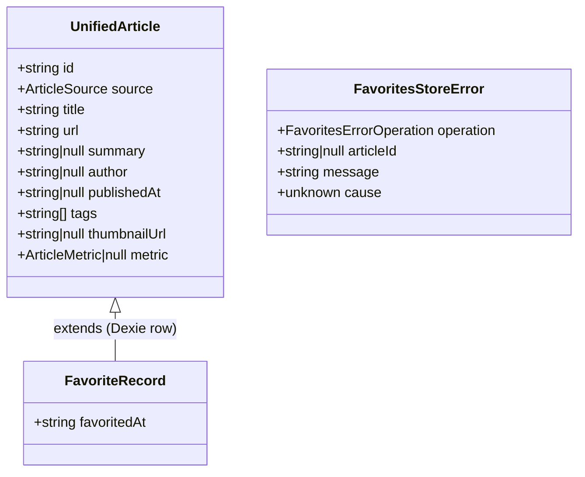

# Favorites

**Status**: Draft
**Created**: 2026-09-16
**Author**: spec-writer agent
**Related Stories**: [docs/user-stories/favorites-user-story.md](../user-stories/favorites-user-story.md)

## Executive Summary

The Favorites feature adds an on-device, offline-only bookmarking capability on top of the existing aggregated news feed. A new `FavoritesStoreService` wraps a Dexie (IndexedDB) database as the single source of truth; a Dexie `liveQuery` drives Angular signals so both the feed's article cards and a new lazy-loaded Favorites view stay reactively in sync without manual subscriptions or optimistic local state. No network calls, backend endpoints, or authentication are involved — the entire feature is client-side persistence and read-side reactivity.

## Requirements Reference

**User Story**: See [User Story](../user-stories/favorites-user-story.md#user-story)

This specification focuses on the technical implementation details for the requirements defined in the user story, in particular Scenarios 1–6 and the associated Acceptance Criteria.

## Technical Analysis

### Affected Areas

- **Models**: New `FavoriteRecord` interface (extends `UnifiedArticle` with a `favoritedAt` timestamp). New `FavoritesStoreError` and `FavoritesErrorOperation` types for the error contract.
- **Data-access / State Services**: New `FavoritesStoreService` (Dexie wrapper, `providedIn: 'root'`) exposing signals for favorite ids, the full favorites list, loading state, and last error. New `FavoritesDatabase` (Dexie subclass) encapsulating schema/versioning.
- **Components**:
  - New `FavoritesViewComponent` (smart, routed) — dedicated Favorites view.
  - New `FavoriteListItemComponent` (presentational) — one row/card in the Favorites view.
  - **Changed**: the existing feed's article-card component (presentational, per the Aggregated News Feed spec) gains a favorite-toggle affordance driven by a boolean `input()` and an `output()` event; the existing feed's smart list component is updated to read favorite state from `FavoritesStoreService` and call `add()`/`remove()`.

  > **Assumption**: The exact existing filenames/class names for the feed's smart component and article-card component could not be confirmed in this session. Implementers should wire the integration points below into whatever those components are actually named; the contract (inputs/outputs/service calls) does not depend on their names.

- **Routing**: New lazy-loaded route `/favorites` → `FavoritesViewComponent`.
- **Forms**: None — this feature has no form input; all interactions are single-click toggles.

### Feature Boundary Considerations

- `FavoritesStoreService` and `FavoritesDatabase` are **Core/Shared** (not scoped to the lazy `favorites` route), because the feed — which is loaded eagerly or on a different route — must also read favorite state for its cards (Scenario 1/2). Suggested location: `src/app/core/favorites/` (or `src/app/shared/favorites/` if the project's existing convention uses `shared` for cross-cutting singletons).
- `FavoritesViewComponent` and `FavoriteListItemComponent` are scoped to a new **lazy-loaded `favorites` feature boundary** (e.g. `src/app/favorites/feature/`).
- Because the store service is shared with the eagerly-used feed, the Dexie dependency itself is **not** deferred to the lazy chunk — it loads as part of the main bundle. This is called out explicitly in Performance & Green Code below since it's an unavoidable trade-off of Scenario 1's requirement that feed cards show favorited state immediately.

### Security Considerations

- No authentication, authorization, or backend API is involved (per user story Acceptance Criteria — "Security & Access Control"). `FavoritesViewComponent` requires no route guard.
- All data stored (article `id`, `title`, `url`, `summary`, `author`, `publishedAt`, `tags`, `thumbnailUrl`, `metric`, `favoritedAt`) is already public, non-sensitive article metadata sourced from the aggregated feed — nothing beyond what the user already sees is persisted.
- Data never leaves the device: no HTTP calls are made by `FavoritesStoreService` or `FavoritesViewComponent` (enforced by design — the store's only I/O is Dexie/IndexedDB).
- IndexedDB is not encrypted at rest by the browser; this is an accepted risk given the data is non-sensitive public article metadata and the user story explicitly rules out sync/accounts.
- Rendered fields (`title`, `summary`, `author`) originate from external APIs upstream of this feature and must continue to be bound via Angular's default interpolation (never `innerHTML`/`bypassSecurityTrust*`) to avoid XSS — no change from existing feed rendering conventions.

### Performance & Green Code Considerations

- The Favorites view makes **zero network requests** on load — it reads exclusively from IndexedDB via `FavoritesStoreService`, satisfying Scenario 4 and the "Performance & Sustainability" acceptance criteria.
- **Bundle impact**: `FavoritesStoreService` + `FavoritesDatabase` (and the `dexie` package) load in the main/eager bundle because the feed needs favorite state synchronously with card rendering. `FavoritesViewComponent` and `FavoriteListItemComponent` remain lazy-loaded behind the `/favorites` route (`loadComponent`), keeping the *view* code out of the initial bundle even though the *store* is shared.
- **Change detection**: `FavoritesViewComponent` and `FavoriteListItemComponent` use `OnPush` and signal-based inputs/outputs.
- **Rendering strategy**: `FavoritesViewComponent` uses `@for (favorite of favorites(); track favorite.id)`. Per the global list-virtualization threshold, if the favorites list can exceed 50 items, wrap it in `cdk-virtual-scroll-viewport` (Scenario/AC: "renders efficiently even as the number of saved favorites grows").
- **Storage minimization**: only the already-normalized `UnifiedArticle` fields plus `favoritedAt` are persisted — no raw API payloads, no duplication of full feed response bodies (AC: "avoiding unnecessary duplication of full feed payloads").
- **Network efficiency**: 0 HTTP requests for the Favorites view (vs. the feed, which fetches in real time per the global data-fetching rule — out of scope here).

**Angular client efficiency (green code)**: lazy-load the `/favorites` route (`loadComponent`); use `OnPush` + signals throughout; use `@for` with `track favorite.id`; use `cdk-virtual-scroll-viewport` above the 50-item threshold; make zero network requests; keep the Dexie dependency as the only non-view cost paid by the eager bundle.

## API Contract

**Not applicable — this feature has no backend API.** Per the user story's "Security & Access Control" acceptance criteria and Scenario 4, Favorites is a fully on-device, offline feature with no account, sync, or server involved. All persistence and reads are local via Dexie/IndexedDB, described in the Data & State Architecture section below instead of a REST contract.

## Client Data & State Architecture



### Models

```typescript
// Dexie table row: the UnifiedArticle shape, wrapped with a local-only timestamp.
export interface FavoriteRecord extends UnifiedArticle {
  /** ISO 8601 timestamp set when the article was favorited; used to sort the Favorites view. */
  favoritedAt: string;
}

export type FavoritesErrorOperation = 'add' | 'remove' | 'load';

export interface FavoritesStoreError {
  operation: FavoritesErrorOperation;
  /** null only for bulk 'load' failures; otherwise the affected article id. */
  articleId: string | null;
  /** User-safe message, safe to render directly in the UI. */
  message: string;
  /** Original thrown value, for logging only — never rendered. */
  cause: unknown;
}
```

### Dexie Schema

| Property | Value |
|---|---|
| Database name | `dev-news-favorites` |
| Schema version | `1` |
| Table name | `favorites` |
| Primary key | `id` (matches `UnifiedArticle.id` — already globally unique/namespaced, e.g. `devto-12345`) |
| Indexes | `favoritedAt` (secondary index, for sorting the Favorites view by recency) |

```typescript
// FavoritesDatabase (Dexie subclass)
class FavoritesDatabase extends Dexie {
  favorites!: Table<FavoriteRecord, string>;

  constructor() {
    super('dev-news-favorites');
    this.version(1).stores({
      favorites: 'id, favoritedAt',
    });
  }
}
```

### FavoritesStoreService State

Built with a Dexie `liveQuery()` bridged to Angular signals via `toSignal()`, so all exposed signals reflect actual persisted state — there is no separate optimistic/local copy of favorited state. This is the mechanism that satisfies Scenario 6 ("the article's favorited state is not silently changed to reflect a false success"): if a write fails, the underlying table is unchanged, so the live-query-derived signals never move.

| Signal / Method | Type | Description |
|---|---|---|
| `favoriteIds` | `Signal<ReadonlySet<string>>` | Reactive set of currently favorited article ids, derived from a live query over the `favorites` table. Feed cards read this to render toggle state. |
| `favorites` | `Signal<FavoriteRecord[]>` | All favorited records, sorted by `favoritedAt` descending. Consumed by `FavoritesViewComponent`. |
| `isLoading` | `Signal<boolean>` | `true` until the live query's first emission resolves. |
| `lastError` | `Signal<FavoritesStoreError \| null>` | Most recent operation error, or `null`. Cleared automatically on the next successful operation, or explicitly via `clearError()`. |
| `isFavorite(id: string)` | `(id: string) => boolean` | Convenience helper: `favoriteIds().has(id)`. Not itself a signal — callers needing reactivity should read `favoriteIds()` directly in a template/computed. |
| `add(article: UnifiedArticle)` | `(article: UnifiedArticle) => Promise<void>` | Upserts a `FavoriteRecord` (article + `favoritedAt: new Date().toISOString()`). **No-op** if `article.id` already exists in the table (checked before write; existing `favoritedAt` is preserved) — satisfies "duplicate add" AC. |
| `remove(id: string)` | `(id: string) => Promise<void>` | Deletes the row with the given `id`. **No-op** (no error) if the id is not present — Dexie's `delete()` on a missing key does not throw, matching the AC directly. |
| `clearError()` | `() => void` | Clears `lastError()` without another store operation (e.g. after the UI dismisses an error banner). |

#### Error Handling Contract

- `add()` and `remove()` return `Promise<void>` and **reject** with a `FavoritesStoreError` if the underlying Dexie write throws (e.g. `QuotaExceededError`, blocked/version-change errors, or any `DexieError`).
- On rejection, the service also sets `lastError()` to the same `FavoritesStoreError` (so a component that isn't directly awaiting the call-site — e.g. the feed card — can still react to it via the signal).
- Callers (components) **must** `await`/`catch` these calls and render an explicit error message (Scenario 6) rather than assuming success. Because favorited state is derived from the live query rather than local component state, no manual rollback is needed — the UI simply never showed the change in the first place if the write failed.
- Errors from `add()`/`remove()` must never throw uncaught inside the store or propagate to the Angular global error handler in a way that crashes the app — they are caught internally, wrapped as `FavoritesStoreError`, and rejected as a normal promise so callers can handle them (AC: "Errors in the Favorites feature do not crash or block the rest of the feed experience").
- The initial `liveQuery` subscription (backing `favorites`/`favoriteIds`) can itself error (e.g. IndexedDB unavailable/blocked). In that case `operation: 'load'`, `articleId: null` is set on `lastError()`, and `favorites()`/`favoriteIds()` fall back to their last known value (or empty on first load) rather than throwing during render.

## Component Design

### Routing

**New Routes** (lazy-loaded):
1. `/favorites` → `FavoritesViewComponent` (via `loadComponent`)

**Navigation Updates**:
- Add a "Favorites" link to the app's primary navigation (wherever the shell/nav component already lives).

### Component Breakdown

#### FavoritesViewComponent (smart component)

**Purpose**: Display all currently saved Favorites, fully offline, with empty/error states.

**Change Detection**: `OnPush`

**State**: Injects `FavoritesStoreService`; reads `favorites`, `isLoading`, `lastError` signals directly in the template.

**Template**:
- `@if (isLoading())` → loading indicator.
- `@else if (favorites().length === 0)` → empty state (per Scenario 5: clear message, e.g. "No favorites saved yet").
- `@else` → `@for (favorite of favorites(); track favorite.id)` rendering `FavoriteListItemComponent`; wrap in `cdk-virtual-scroll-viewport` once list length can exceed 50.
- `@if (lastError())` → dismissible inline error banner rendering `lastError()!.message`, with a control calling `clearError()`.

**Child Components**:
- `FavoriteListItemComponent` (presentational, `input<FavoriteRecord>()`, `output<string>() remove` emitting the article id)

**User Interactions**:
- Click "remove" on an item → `FavoritesViewComponent` calls `favoritesStoreService.remove(id)`; on rejection, error is surfaced via `lastError()` (already rendered by the template above) — the item does **not** disappear until the underlying delete actually succeeds and the live query re-emits (Scenario 3 / Scenario 6).
- Click article title/link → standard external navigation to `article.url` (`target="_blank" rel="noopener noreferrer"`), no in-app routing.

#### FavoriteListItemComponent (presentational)

**Purpose**: Render one favorited article with enough detail to identify/revisit it and an un-favorite control.

**Inputs** (signal-based): `favorite = input.required<FavoriteRecord>()`

**Outputs** (signal-based): `remove = output<string>()` (emits `favorite().id`)

**Displayed fields**: `title`, `source`, `url` (as a link), `author` (if present), `publishedAt` (if present) — satisfies AC "enough information (title, source, link)".

#### Feed Integration (changed existing components)

- The existing feed smart component injects `FavoritesStoreService` and reads `favoriteIds()`.
- For each rendered `UnifiedArticle`, it passes `isFavorited = favoriteIds().has(article.id)` as a boolean input into the existing article-card component.
- The article-card component (presentational) renders a favorite-toggle button reflecting the `isFavorited` input and emits an `output<UnifiedArticle>()` (e.g. `toggleFavorite`) on click — it does **not** inject the store service directly, preserving presentational purity.
- The feed smart component's handler calls `favoritesStoreService.add(article)` or `.remove(article.id)` based on current `isFavorited` state, and surfaces `FavoritesStoreError` (via `.catch`) as an inline error on the feed (Scenario 6), without blocking the rest of the feed from rendering.

### Interaction Flows

#### Favorite / Un-favorite from the Feed
1. User clicks the favorite-toggle control on an article card.
2. Card emits `toggleFavorite` with the `UnifiedArticle`.
3. Feed smart component calls `add()` or `remove()` on `FavoritesStoreService` depending on current state.
4. On success: the Dexie live query re-emits, `favoriteIds()` updates, and the card's `isFavorited` input flips automatically — no manual state mutation needed (Scenario 1/2).
5. On failure: an inline error is shown on the feed; the card's toggle state remains unchanged since `favoriteIds()` never moved (Scenario 6).

#### Un-favorite from the Favorites View
1. User clicks "remove" on a `FavoriteListItemComponent`.
2. `FavoritesViewComponent` calls `favoritesStoreService.remove(id)`.
3. On success: the item disappears from `favorites()` via the live query; if the user later views the feed, the card for that article also reflects un-favorited state since both read the same `favoriteIds()`/table (Scenario 3).
4. On failure: item remains in the list, and the error banner is shown (Scenario 6).

### Accessibility Requirements

- The favorite-toggle button on article cards has an `aria-pressed` attribute bound to `isFavorited` and an `aria-label` describing the action (e.g. "Add to Favorites" / "Remove from Favorites").
- The remove control in `FavoriteListItemComponent` has an `aria-label` including the article title (e.g. "Remove {{ title }} from Favorites").
- The error banner is rendered inside an `aria-live="polite"` region so screen reader users are notified of Scenario 6 failures without focus being stolen.
- Full keyboard operability for toggling and removing favorites (buttons, not divs with click handlers).

### Responsive Behavior

- Desktop (>1024px): Favorites list rendered as a single-column list of compact rows (list, not a card grid, since detail needs are minimal — title/source/link).
- Tablet/Mobile (<1024px): same single-column list, full-width rows.

### Performance & Green Code Budget (Angular 22)

- **Bundle budget**: `/favorites` lazy chunk (view components only) ≤ 50KB; enforce via an `angular.json` budget entry scoped to that route's output chunk.
- **Change detection strategy**: `FavoritesViewComponent` and `FavoriteListItemComponent` use `OnPush` and signal-based inputs/outputs.
- **Network efficiency**: 0 HTTP requests on `/favorites` load (Scenario 4).
- **Rendering strategy**: `@for` with `track favorite.id`; `cdk-virtual-scroll-viewport` required once the favorites list can exceed 50 items.
- **Deferred loading**: not applicable — the Favorites view has no below-the-fold or rarely-used sub-UI beyond the list itself.
- **Asset optimization**: reuse the feed's existing thumbnail rendering approach (e.g. `NgOptimizedImage`) for `thumbnailUrl` if the article card already does so; no new asset pipeline introduced.

## Testing Requirements

Dexie access is tested against `fake-indexeddb` (or Dexie's own test utilities) so unit tests run headlessly with no real browser IndexedDB — matching the project's ChromeHeadless CI requirement. These scenarios will be implemented by the `tdd-test-first` / `tdd-implementation` agent pair; this section specifies required coverage only.

### Data-access / State Services (`FavoritesStoreService`)

- [ ] GivenEmptyFavoritesTable_WhenServiceInitializes_ThenFavoritesSignalIsEmptyArray (validates Scenario 5 data path)
- [ ] GivenNewArticle_WhenAddCalled_ThenRecordIsPersistedWithFavoritedAtAndFavoriteIdsSignalIncludesId (validates Scenario 1)
- [ ] GivenAlreadyFavoritedArticle_WhenAddCalledAgainWithSameId_ThenNoDuplicateRowIsWrittenAndFavoritedAtIsUnchanged (validates "duplicate add" AC)
- [ ] GivenFavoritedArticle_WhenRemoveCalled_ThenRecordIsDeletedAndFavoriteIdsSignalNoLongerIncludesId (validates Scenario 2/3)
- [ ] GivenIdNotCurrentlyFavorited_WhenRemoveCalled_ThenNoErrorIsThrownAndTableIsUnchanged (validates "un-favorite non-favorited" no-op AC)
- [ ] GivenMultipleFavorites_WhenFavoritesSignalRead_ThenRecordsAreSortedByFavoritedAtDescending
- [ ] GivenDexiePutRejects_WhenAddCalled_ThenPromiseRejectsWithFavoritesStoreErrorAndFavoriteIdsSignalIsUnchanged (validates Scenario 6, add path)
- [ ] GivenDexieDeleteRejects_WhenRemoveCalled_ThenPromiseRejectsWithFavoritesStoreErrorAndFavoritesSignalStillContainsRecord (validates Scenario 6, remove path)
- [ ] GivenWriteFailure_WhenErrorIsSet_ThenLastErrorSignalReflectsOperationAndArticleId
- [ ] GivenLastErrorSet_WhenClearErrorCalled_ThenLastErrorSignalIsNull

### Components

- [ ] GivenFavoritesViewComponent_WhenFavoritesSignalEmpty_ThenEmptyStateMessageIsShown (validates Scenario 5)
- [ ] GivenFavoritesViewComponent_WhenIsLoadingTrue_ThenLoadingIndicatorIsShownInsteadOfList
- [ ] GivenFavoritesViewComponent_WhenListRendered_ThenTrackByUsesFavoriteId
- [ ] GivenFavoritesViewComponent_WhenLastErrorSignalSet_ThenErrorBannerIsRenderedInAriaLiveRegion (validates Scenario 6)
- [ ] GivenFavoriteListItemComponent_WhenRemoveClicked_ThenRemoveOutputEmitsFavoriteId
- [ ] GivenArticleCardComponent_WhenIsFavoritedInputTrue_ThenToggleControlReflectsPressedState (validates Scenario 1/2 UI feedback)
- [ ] GivenArticleCardComponent_WhenToggleClicked_ThenToggleFavoriteOutputEmitsArticle
- [ ] GivenFeedComponent_WhenAddRejects_ThenInlineErrorIsShownAndCardIsFavoritedInputRemainsFalse (validates Scenario 6 from the feed)

### Routing

- [ ] GivenAppRoutes_WhenNavigatingToFavoritesPath_ThenFavoritesViewComponentIsLazilyLoaded

**Coverage mapping**: Scenario 1 → add tests; Scenario 2/3 → remove tests (both entry points); Scenario 4 → zero-network assertion is structural (no `HttpClient`/`HttpTestingController` expectations in `FavoritesStoreService`/`FavoritesViewComponent` specs); Scenario 5 → empty-state test; Scenario 6 → all write-failure tests above.
