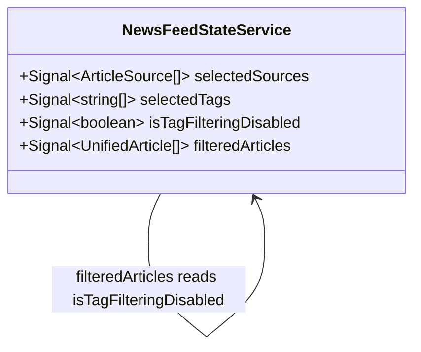

# Hacker News Tag Filter Disable

**Status**: Superseded (for Hacker News) — see Status Update below
**Created**: 2026-10-01
**Author**: spec-writer agent
**Related Stories**: [docs/user-stories/hackernews-tag-filter-disable-user-story.md](../user-stories/hackernews-tag-filter-disable-user-story.md)

## Status Update (2026-10-01)

`HackerNewsFetcherService.fetchArticles()` was fixed at the data layer: it now tracks, per hit, which `DEVNEWS_TAGS` query term(s) returned it (`matchedTopics`), and `ArticleNormalizerService.normalizeHackerNews` derives `UnifiedArticle.tags` from `matchedTopics` instead of Algolia's `_tags` metadata. Hacker News articles are therefore genuinely topic-filterable, and `'hackernews'` has been **removed** from `NewsFeedStateService.UNTAGGABLE_SOURCES` (now empty, pending a similar fix for Hashnode — see [docs/specs/aggregated-news-feed.md](./aggregated-news-feed.md)).

Everything below this point describes the **original disable-based workaround**, which is no longer active for Hacker News. The `isTagFilteringDisabled` computed signal, `FeedFiltersComponent.tagFilteringDisabled` input, and the component wiring it describes **remain in the codebase** as the general mechanism for any future untaggable source — only the root-cause analysis and the `UNTAGGABLE_SOURCES` set membership have changed.

## Executive Summary

This spec refines the existing filter behavior defined in [aggregated-news-feed.md](./aggregated-news-feed.md) by adding one derived boolean signal to the existing `NewsFeedStateService` and one boolean input to the existing `FeedFiltersComponent`. No new models, services, routes, or API calls are introduced — this is a pure client-side computed-state and template change confined to three already-existing files.

## Requirements Reference

**User Story**: See [User Story](../user-stories/hackernews-tag-filter-disable-user-story.md#user-story)

This specification focuses on the technical implementation details for the requirements defined in the user story.

## Technical Analysis

### Affected Areas

- **Models**: None. No new TypeScript interfaces/types are introduced or changed.
- **Data-access / State Services**: **Changed** — [`NewsFeedStateService`](../../src/app/services/news-feed-state.service.ts) gains one new computed signal (`isTagFilteringDisabled`) and its existing `filteredArticles` computed signal gains one additional condition. `selectedSourceState`/`selectedTagState`, `toggleSourceFilter`, `toggleTagFilter`, and `clearFilters` are unchanged.
- **Components**: **Changed** — [`FeedFiltersComponent`](../../src/app/features/news-feed/feed-filters/feed-filters.component.ts) gains one new signal input and a template change to its Topics button group. [`NewsFeedComponent`](../../src/app/features/news-feed/news-feed.component.ts) gains one new template binding passing the new state through.
- **Routing**: None.
- **Forms**: None.

### Why Hacker News tags can never match the Topics taxonomy

[`HackerNewsFetcherService.fetchArticles()`](../../src/app/services/fetchers/hackernews-fetcher.service.ts) queries the Algolia HN Search API once per `DEVNEWS_TAGS` entry using that tag as a full-text `query` parameter (`tags: 'story'`), not as a structured topic facet. The raw `HackerNewsHit._tags` field returned by that API is Algolia's own story classification (e.g. `['story', 'author_jdoe', 'ask_hn']`), unrelated to the app's topic taxonomy. [`ArticleNormalizerService.normalizeHackerNews()`](../../src/app/services/article-normalizer.service.ts) maps `hit._tags` directly to `UnifiedArticle.tags` (lowercased) with no re-derivation from the matched `DEVNEWS_TAGS` query term. Consequently, a Hacker News `UnifiedArticle.tags` array can **never** contain a value from `DEVNEWS_TAGS` (e.g. `'angular'`, `'dotnet'`), so the existing `filteredArticles` tag-matching predicate (`tags.some(tag => article.tags.includes(tag.toLowerCase()))`) always evaluates to `false` for every Hacker News article whenever any tag filter is active — this is the root cause the user story addresses.

### Feature Boundary Considerations

No new feature boundary is introduced. All changes land inside the existing `news-feed` feature boundary established by [aggregated-news-feed.md](./aggregated-news-feed.md) — no new lazy-loading chunk, no new Core/Shared service.

### Angular Model Generator — No-Op Confirmation

Per the global agent pipeline, this section exists so the `angular-model-generator` step can be treated as a confirmed no-op for this feature rather than skipped silently:

> **No new TypeScript models or data-access services are required by this spec.** `isTagFilteringDisabled` is a `computed()` signal added directly to the existing `NewsFeedStateService`, and `tagFilteringDisabled` is a `boolean` `input()` added directly to the existing `FeedFiltersComponent`. There is no new `.model.ts` file, no new injectable service, and no change to `UnifiedArticle`, `ArticleSource`, or `FeedFilterState`. The `angular-model-generator` agent should produce nothing for this feature and simply confirm this statement before implementation proceeds.

### Security Considerations

Not applicable — this change affects only client-side derived UI state (which buttons are interactive) and introduces no new data access, network calls, authentication, or authorization concerns, consistent with the user story's "Security & Access Control" acceptance criteria.

### Performance & Green Code Considerations

- The new `isTagFilteringDisabled` computed signal reads only the existing `selectedSources` signal — no new dependencies, no new HTTP requests, and no change to `NewsFeedStateService.loadFeed()`'s fan-out behavior.
- Recomputation is synchronous and O(1) (a length check plus a single element comparison), re-evaluated automatically by Angular's signal graph only when `selectedSources()` changes — satisfying the AC that this "does not trigger any additional network requests or re-fetch of the feed."
- **Angular client efficiency (green code)**: no new lazy-loading boundary is needed (change is inside the existing `news-feed` chunk); both affected components keep `OnPush` change detection and signal-based inputs/outputs; no new bundle weight beyond a few lines of computed logic and template markup.

## API Contract

**Not applicable.** This feature makes no new API calls and does not change the existing API contract documented in [aggregated-news-feed.md § API Contract](./aggregated-news-feed.md#3-api-contract). `HackerNewsFetcherService` and `ArticleNormalizerService.normalizeHackerNews()` are read-only context for this spec (see [above](#why-hacker-news-tags-can-never-match-the-topics-taxonomy)) and are not modified.

## Client Data & State Architecture

No new models. The diagram below shows only the signal relationship being added to the existing `NewsFeedStateService` (full existing state is documented in [aggregated-news-feed.md § Client Data & State Architecture](./aggregated-news-feed.md#4-client-data--state-architecture) and is not repeated here).



### NewsFeedStateService State (delta only)

| Signal | Type | Description |
|---|---|---|
| `isTagFilteringDisabled` | `Signal<boolean>` (computed, **new**) | `true` exactly when `selectedSources()` has length `1` and its only element is `'hackernews'`; `false` in every other case (zero sources, Hacker News plus others, or any single non-Hacker-News source) |
| `filteredArticles` | `Signal<UnifiedArticle[]>` (computed, **changed**) | Same source-filter behavior as before; the tag-filter condition is now skipped entirely when `isTagFilteringDisabled()` is `true` (see rule below) |

**Updated filter combination rule** (supersedes the rule in [aggregated-news-feed.md](./aggregated-news-feed.md#4-client-data--state-architecture) for this one computed signal only; source-filter semantics are unchanged):

```ts
readonly isTagFilteringDisabled: Signal<boolean> = computed(() => {
  const sources = this.selectedSourceState();
  return sources.length === 1 && sources[0] === 'hackernews';
});

readonly filteredArticles: Signal<UnifiedArticle[]> = computed(() => {
  const sources = this.selectedSourceState();
  const tags = this.selectedTagState();
  const tagFilteringDisabled = this.isTagFilteringDisabled();
  return this.articleState().filter(
    (article) =>
      (sources.length === 0 || sources.includes(article.source)) &&
      (tagFilteringDisabled ||
        tags.length === 0 ||
        tags.some((tag) => article.tags.includes(tag.toLowerCase()))),
  );
});
```

`isTagFilteringDisabled` is declared as a new `readonly` computed field immediately after the existing `isPartialFailure` computed field and before `filteredArticles`, matching the class's existing declaration order (signals/computed fields, then constants, then methods).

#### Data & State Design Principles

- `selectedSourceState` and `selectedTagState` remain the sole mutable, private signals backing this behavior — no new private signal is introduced, and **`selectedTagState` is never mutated or cleared by `isTagFilteringDisabled` becoming `true`**, satisfying the "tags preserved, not cleared" requirement.
- `toggleSourceFilter`, `toggleTagFilter`, and `clearFilters` are unchanged — `toggleTagFilter` still mutates `selectedTagState` even while `isTagFilteringDisabled()` is `true` (the component layer is responsible for not invoking it while disabled, per [Component Design](#component-design) below); the service itself places no guard on the method, keeping state mutation and UI-interactivity concerns separate.
- No breaking changes to `UnifiedArticle`, `ArticleSource`, `FeedFilterState`, or any other existing model.

## Component Design

No new routes, no navigation changes, no new components. Both affected components already exist (see [aggregated-news-feed.md § Component Design](./aggregated-news-feed.md#component-design) for their full existing contracts); only the deltas are specified below.

### FeedFiltersComponent (presentational) — changed

**Location**: [feed-filters.component.ts](../../src/app/features/news-feed/feed-filters/feed-filters.component.ts)

**New Input** (signal-based):
- `tagFilteringDisabled = input<boolean>(false)` — when `true`, every Topics button is rendered non-interactive; the Sources button group and the "Clear filters" button are unaffected by this input.

**Template changes** ([feed-filters.component.html](../../src/app/features/news-feed/feed-filters/feed-filters.component.html)):
- The Topics `@for` loop's `<button>` gains `[disabled]="tagFilteringDisabled()"`.
- The Topics button's class list gains the same disabled-style utility classes already used on the "Clear filters" button for visual consistency: `disabled:cursor-not-allowed disabled:opacity-40`.
- `[attr.aria-pressed]="selectedTags().includes(tag.toLowerCase())"` is **unchanged** — a tag that was selected before `tagFilteringDisabled()` became `true` continues to render with `aria-pressed="true"` (and the existing `aria-pressed:*` selected-style classes), satisfying the AC that previously-selected topics stay visibly indicated as selected while disabled.
- The Sources `@for` loop and its `<button>` are **not modified** — disabling Topics never disables Sources.
- Because the element has a native `disabled` attribute, clicking it does not fire the `(click)` handler — `tagToggled` cannot emit for a disabled Topics button without any extra guard code in the component class.

### NewsFeedComponent (smart component) — changed

**Location**: [news-feed.component.ts](../../src/app/features/news-feed/news-feed.component.ts) / [news-feed.component.html](../../src/app/features/news-feed/news-feed.component.html)

**Template change**: the existing `<app-feed-filters>` binding gains one new input binding:

```html
<app-feed-filters
  [availableSources]="availableSources"
  [availableTags]="availableTags"
  [selectedSources]="selectedSources"
  [selectedTags]="selectedTags"
  [tagFilteringDisabled]="state.isTagFilteringDisabled()"
  (sourceToggled)="state.toggleSourceFilter($event)"
  (tagToggled)="state.toggleTagFilter($event)"
  (filtersCleared)="state.clearFilters()"
/>
```

Since `state` (the injected `NewsFeedStateService`) is already read directly in this template (e.g. `state.status()`, `state.toggleSourceFilter($event)`), `state.isTagFilteringDisabled()` is bound directly with no new component class member, getter, or method required — consistent with how `state.status()`/`state.isPartialFailure()`/`state.failedSources()` are already used directly in this same template.

### Interaction Flows

#### Narrowing to Hacker News Only (disable)
1. User toggles sources such that `selectedSources()` becomes exactly `['hackernews']` (either by selecting Hacker News as the sole source, or by deselecting all other sources while Hacker News remains selected).
2. `isTagFilteringDisabled` recomputes to `true`.
3. `FeedFiltersComponent` re-renders its Topics buttons as `disabled`; previously selected tags remain visually indicated as selected via unchanged `aria-pressed` state.
4. `filteredArticles` recomputes, applying only the source-filter condition; any previously selected tags are not applied, so matching Hacker News articles are shown rather than an empty list.

#### Broadening Sources Again (re-enable)
1. User selects an additional source (so `selectedSources().length > 1`) or deselects Hacker News entirely (so `selectedSources().length === 0`).
2. `isTagFilteringDisabled` recomputes to `false`.
3. `FeedFiltersComponent` re-renders its Topics buttons as interactive again.
4. `filteredArticles` recomputes, re-applying `selectedTagState()` (unchanged throughout) to the article set — any topics selected before Hacker News became the sole source automatically resume filtering with no user action needed.

### Accessibility Requirements

- Disabled Topics `<button>` elements use the native `disabled` attribute (not just a CSS class), so they are automatically excluded from the tab order and announced as unavailable by assistive technology — no additional `aria-disabled` is needed alongside a native `disabled` attribute.
- `aria-pressed` continues to reflect true selection state on disabled Topics buttons (per the user story: "no separate error message or notice is required… the disabled appearance itself is sufficient feedback").
- No new `aria-live` region is introduced — the AC explicitly states the disabled visual appearance alone is sufficient feedback.

### Responsive Behavior

Unchanged — no layout changes are introduced by this spec; the Topics button group's existing responsive wrapping behavior ([feed-filters.component.html](../../src/app/features/news-feed/feed-filters/feed-filters.component.html)) is unaffected.

### Performance & Green Code Budget (Angular 22)

- **Bundle budget**: No change — no new files, no new lazy chunk.
- **Change detection strategy**: `FeedFiltersComponent` and `NewsFeedComponent` keep `OnPush` and signal-based inputs/outputs; `tagFilteringDisabled` is itself a signal input, so no manual change-detection trigger is needed when it flips.
- **Network efficiency**: Zero additional HTTP requests — identical to the existing filter-toggle behavior.
- **Rendering strategy**: Unchanged — the Topics `@for` loop still uses `track tag`.

## Testing Requirements

### Unit Test Scenarios

#### Data-access / State Services (`NewsFeedStateService`)

- [ ] GivenNoSourcesSelected_WhenIsTagFilteringDisabledRead_ThenFalse (validates AC: zero sources = enabled)
- [ ] GivenSingleNonHackerNewsSourceSelected_WhenIsTagFilteringDisabledRead_ThenFalse (validates Scenario 5)
- [ ] GivenHackerNewsPlusAnotherSourceSelected_WhenIsTagFilteringDisabledRead_ThenFalse (validates Scenario 3)
- [ ] GivenOnlyHackerNewsSelected_WhenIsTagFilteringDisabledRead_ThenTrue (validates Scenario 1 / Core Functionality)
- [ ] GivenOnlyHackerNewsSelectedAndTagsSelected_WhenFilteredArticlesRead_ThenTagCriteriaIsIgnoredAndMatchingHackerNewsArticlesAreReturned (validates Core Functionality — feed is not forced empty)
- [ ] GivenOnlyHackerNewsSelectedWithNoTagsSelected_WhenFilteredArticlesRead_ThenOnlySourceFilterAppliesAndResultIsNotForcedEmpty (validates Input Validation — disabled condition is independent of selected tags)
- [ ] GivenOnlyHackerNewsSelectedAndTagsSelected_WhenIsTagFilteringDisabledBecomesTrue_ThenSelectedTagsSignalRemainsUnchanged (validates Data Integrity — tags are preserved, not cleared)
- [ ] GivenOnlyHackerNewsSelectedAndTagsSelected_WhenAnotherSourceIsAlsoSelected_ThenFilteredArticlesReapplyThePreviouslySelectedTags (validates Scenario 3 / Scenario 6)
- [ ] GivenOnlyHackerNewsSelectedAndTagsSelected_WhenHackerNewsIsDeselectedLeavingZeroSources_ThenFilteredArticlesReapplyThePreviouslySelectedTagsAcrossAllSources (validates Scenario 4 / Scenario 6)
- [ ] GivenSourcesChangeFromAllToHackerNewsOnly_WhenIsTagFilteringDisabledRead_ThenItRecomputesImmediatelyWithoutAdditionalAction (validates AC: "re-evaluates immediately on every source selection change")

#### Components (`FeedFiltersComponent`)

- [ ] GivenTagFilteringDisabledInputOmitted_WhenComponentCreated_ThenDefaultsToFalseAndTopicsButtonsAreEnabled (default-value test)
- [ ] GivenTagFilteringDisabledFalse_WhenTopicsButtonsRendered_ThenNoneHaveTheDisabledAttribute
- [ ] GivenTagFilteringDisabledTrue_WhenTopicsButtonsRendered_ThenAllHaveTheDisabledAttributeAndDisabledStyleClasses (validates User Experience — visually distinct, consistent with "Clear filters")
- [ ] GivenTagFilteringDisabledTrue_WhenSourceButtonsRendered_ThenNoneHaveTheDisabledAttribute (validates Core Functionality — Sources unaffected)
- [ ] GivenTagFilteringDisabledTrue_WhenATopicsButtonIsClicked_ThenTagToggledOutputDoesNotEmit (validates Scenario 2)
- [ ] GivenTagFilteringDisabledTrueAndATagWasPreviouslySelected_WhenTopicsButtonsRendered_ThenThatButtonStillHasAriaPressedTrue (validates Scenario 6 — selected visual state is retained while disabled)
- [ ] GivenTagFilteringDisabledTransitionsFromTrueToFalse_WhenTopicsButtonsRerendered_ThenTheDisabledAttributeIsRemovedAndButtonsAreClickableAgain (validates Scenario 3/4 — re-enable)

#### Components (`NewsFeedComponent`)

- [ ] GivenNewsFeedComponentRendered_WhenStateIsTagFilteringDisabledIsTrue_ThenFeedFiltersComponentReceivesTagFilteringDisabledAsTrue (wiring test — validates the state is passed down, per requirement 5)
- [ ] GivenNewsFeedComponentRendered_WhenStateIsTagFilteringDisabledIsFalse_ThenFeedFiltersComponentReceivesTagFilteringDisabledAsFalse

**Coverage note**: Every acceptance criterion and scenario in the user story maps to at least one scenario above. Scenarios exercising unchanged behavior (`toggleSourceFilter`, `toggleTagFilter`, `clearFilters` mechanics, source-only filtering without Hacker News involved) are already covered by the existing [news-feed-state.service.spec.ts](../../src/app/services/news-feed-state.service.spec.ts) and [feed-filters.component.spec.ts](../../src/app/features/news-feed/feed-filters/feed-filters.component.spec.ts) suites and are out of scope for this spec's test list.
