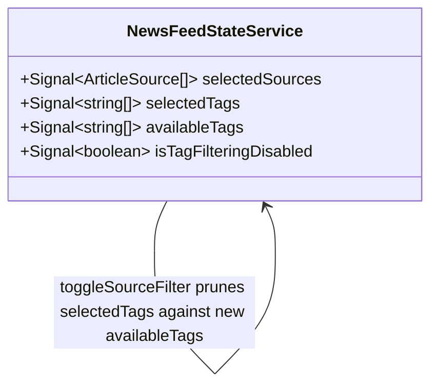

# Source-Scoped Tag Filters

**Status**: Draft
**Created**: 2026-10-01
**Author**: spec-writer agent
**Related Stories**: [docs/user-stories/source-scoped-tag-filters-user-story.md](../user-stories/source-scoped-tag-filters-user-story.md)

## Executive Summary

This spec refines the existing filter behavior defined in [aggregated-news-feed.md](./aggregated-news-feed.md) by converting `NewsFeedStateService.availableTags` from a static constant into a `computed()` signal derived from `selectedSourceState`, and by auto-deselecting any currently-selected tag that falls outside the newly scoped tag set whenever the source selection changes. No new models, components, or routes are introduced — this is a pure client-side computed-state change confined to `NewsFeedStateService` and `NewsFeedComponent`, with no changes to `FeedFiltersComponent`'s public API or template.

## Requirements Reference

**User Story**: See [User Story](../user-stories/source-scoped-tag-filters-user-story.md#user-story)

This specification focuses on the technical implementation details for the requirements defined in the user story.

## Technical Analysis

### Affected Areas

- **Models**: None. No new TypeScript interfaces/types are introduced or changed. `ArticleSource` ([article.model.ts](../../src/app/models/article.model.ts)) is read-only context.
- **Data-access / State Services**: **Changed** — [`NewsFeedStateService`](../../src/app/services/news-feed-state.service.ts): `availableTags` becomes a `computed()` signal (was a static `readonly string[]` field); a new private static `SOURCE_TAG_SETS` mapping is added; `toggleSourceFilter` gains auto-deselection logic for now out-of-scope selected tags. `selectedSourceState`, `selectedTagState`, `toggleTagFilter`, `clearFilters`, and `isTagFilteringDisabled` are otherwise unchanged.
- **Components**: **Changed** — [`NewsFeedComponent`](../../src/app/features/news-feed/news-feed.component.ts): the `availableTags: string[]` field (populated once at construction) is replaced with a reactive accessor so `FeedFiltersComponent` receives a live-updating array. `FeedFiltersComponent` itself (`.ts` and `.html`) is **unchanged** — it continues to declare `availableTags = input.required<string[]>()` and has no knowledge that the array is now source-scoped.
- **Routing**: None.
- **Forms**: None.

### Angular Model Generator — No-Op Confirmation

Per the global agent pipeline, this section exists so the `angular-model-generator` step can be treated as a confirmed no-op for this feature rather than skipped silently:

> **No new TypeScript models or data-access services are required by this spec.** The source→tag-set mapping is a `Record<ArticleSource, readonly string[]>` constant added directly inside the existing `NewsFeedStateService`, and `availableTags` changes from a field to a `computed()` signal on that same existing service. There is no new `.model.ts` file, no new injectable service, and no change to `UnifiedArticle`, `ArticleSource`, or `FeedFilterState`. The `angular-model-generator` agent should produce nothing for this feature and simply confirm this statement before implementation proceeds.

### Feature Boundary Considerations

No new feature boundary is introduced. All changes land inside the existing `news-feed` feature boundary established by [aggregated-news-feed.md](./aggregated-news-feed.md) — no new lazy-loading chunk, no new Core/Shared service.

### Security Considerations

Not applicable — this change affects only client-side derived UI state (which tags are listed/selected) and introduces no new data access, network calls, authentication, or authorization concerns, consistent with the user story's "Security & Access Control" acceptance criteria.

### Performance & Green Code Considerations

- `availableTags` recomputation reads only the existing `selectedSourceState` signal — no new HTTP requests, no change to `loadFeed()`'s fan-out behavior.
- Recomputation is synchronous: a `.flatMap()`/`for`-loop over at most 4 sources' tag arrays (each ≤ ~26 entries) followed by a single-pass lowercase dedup — negligible cost, re-evaluated automatically by Angular's signal graph only when `selectedSourceState()` changes.
- **Angular client efficiency (green code)**: no new lazy-loading boundary needed (change is inside the existing `news-feed` chunk); `NewsFeedComponent` and `FeedFiltersComponent` keep `OnPush` change detection and signal-based inputs/outputs; no new bundle weight beyond a small mapping constant and a few lines of computed logic.

## API Contract

**Not applicable.** This feature makes no new API calls and does not change the existing API contract documented in [aggregated-news-feed.md § API Contract](./aggregated-news-feed.md#3-api-contract).

## Client Data & State Architecture

No new models. The diagram below shows only the signal relationships being added/changed on the existing `NewsFeedStateService` (full existing state is documented in [aggregated-news-feed.md § Client Data & State Architecture](./aggregated-news-feed.md#4-client-data--state-architecture) and is not repeated here).



### Source → Tag-Set Mapping

A new `private static readonly` lookup is added to `NewsFeedStateService`, mapping each `ArticleSource` to the tag-set constant it draws from (per [topic-tags.ts](../../src/app/data/topic-tags.ts)):

```ts
private static readonly SOURCE_TAG_SETS: Record<ArticleSource, readonly string[]> = {
  devto: DEVNEWS_TAGS,
  hackernews: DEVNEWS_TAGS,
  mslearn: MSLEARN_TAGS,
  github: GITHUB_TAGS,
};
```

This is a plain object literal (not a `Map`), matching the existing `UNTAGGABLE_SOURCES` static-field convention already in the file. Both `devto` and `hackernews` intentionally point at the same `DEVNEWS_TAGS` array reference (per Scenario 2 of the user story — "selecting Hacker News instead of \[or in addition to\] Dev.to shows that same tag set").

### NewsFeedStateService State (delta only)

| Signal | Type | Description |
|---|---|---|
| `availableTags` | `Signal<string[]>` (computed, **changed** — was `readonly string[]`) | When `selectedSourceState()` is empty: the full lowercased, deduped union of `DEVNEWS_TAGS ∪ MSLEARN_TAGS ∪ GITHUB_TAGS` (unchanged default behavior). When one or more sources are selected: the lowercased, deduped union of `SOURCE_TAG_SETS[source]` for each selected source, built in `availableSources` order (`devto`, `mslearn`, `hackernews`, `github`) so first-seen casing/order is stable regardless of selection order. |

**Implementation**:

```ts
readonly availableTags: Signal<string[]> = computed(() => {
  const selectedSources = this.selectedSourceState();
  const sourcesToUse = selectedSources.length === 0 ? this.availableSources : this.availableSources.filter((source) => selectedSources.includes(source));
  const seen = new Set<string>();
  const result: string[] = [];
  for (const source of sourcesToUse) {
    for (const tag of NewsFeedStateService.SOURCE_TAG_SETS[source] ?? []) {
      const normalized = tag.toLowerCase();
      if (!seen.has(normalized)) {
        seen.add(normalized);
        result.push(normalized);
      }
    }
  }
  return result;
});
```

Notes on this implementation:
- Iterating over `this.availableSources` (fixed `devto` → `mslearn` → `hackernews` → `github` order) rather than `selectedSources` (user click order) guarantees the resulting array's tag order is stable and independent of the order in which the user toggled sources — satisfying the user story's "stable casing... not shown with flickering or inconsistent casing across re-renders" requirement.
- When `selectedSources()` is empty, `sourcesToUse` is `this.availableSources` (all 4), reproducing the current default (full union) behavior byte-for-byte.
- `SOURCE_TAG_SETS[source] ?? []` guards against a source with no mapped tag set (none exist today, but this satisfies the AC "A Source with no mapped tag set defined does not cause an error; it simply contributes no tags").
- Deduplication is case-insensitive via `.toLowerCase()` before the `Set` membership check — this matches the existing normalization already used by `toggleTagFilter` and the pre-existing static `availableTags` field, so no new casing convention is introduced.
- This computed signal has no interaction with `isTagFilteringDisabled`: it keeps producing a (now-irrelevant) tag list even while tag filtering is disabled, exactly as the former static field did. `FeedFiltersComponent` already independently disables the Topics buttons via its own `tagFilteringDisabled` input — see [Interaction with isTagFilteringDisabled](#interaction-with-istagfilteringdisabled) below.

### Auto-Deselection of Out-of-Scope Tags

**Design decision**: auto-deselection is implemented as a **synchronous step inside `toggleSourceFilter`**, executed immediately after the source selection changes, rather than as a separate `effect()`. Rationale:
- `toggleSourceFilter` is the single method that mutates `selectedSourceState`, so pruning at that single call site is simpler to reason about and test than registering an `effect()` with its own injection-context lifecycle (`effect()` would also require running once with the initial empty state, and its async/microtask scheduling is harder to assert deterministically in synchronous unit tests compared to a plain method call).
- This mirrors the user story's framing ("when the user deselects a source...") as a direct consequence of the toggle action, not a passively-observed side effect.

**Updated `toggleSourceFilter`**:

```ts
toggleSourceFilter(source: ArticleSource): void {
  this.selectedSourceState.update((sources) =>
    sources.includes(source) ? sources.filter((item) => item !== source) : [...sources, source],
  );
  this.pruneOutOfScopeTags();
}

private pruneOutOfScopeTags(): void {
  const stillAvailable = new Set(this.availableTags());
  this.selectedTagState.update((tags) => tags.filter((tag) => stillAvailable.has(tag)));
}
```

Because `availableTags` is itself a `computed()` signal, reading `this.availableTags()` inside `pruneOutOfScopeTags()` (called immediately after `selectedSourceState` is updated) always reflects the **new** scoped tag set, not the pre-toggle one. `selectedTagState` entries are already stored lowercased (per the existing `toggleTagFilter` normalization), matching `availableTags()`'s lowercased entries, so the `Set` membership check requires no extra normalization.

This satisfies:
- **Scenario 5** (narrowing sources removes the now out-of-scope topic from both the available list and the active filter).
- **User Experience AC** ("Topics that remain valid under the new source scope keep their selected state across a source selection change") — `Array.prototype.filter` only removes entries absent from `stillAvailable`; valid entries are left in their existing array position/casing, untouched.
- **Data Integrity AC** ("Deselecting a now out-of-scope topic... only affects the active topic filter selection, not the user's selected Source filters") — `pruneOutOfScopeTags()` only ever calls `this.selectedTagState.update(...)`; it never touches `selectedSourceState`.

`clearFilters()` is unchanged (it already resets both signals to `[]`, which is a strict subset of what pruning would do, so no additional pruning call is needed there).

#### Data & State Design Principles

- `selectedSourceState` and `selectedTagState` remain the sole mutable, private signals backing this behavior — no new private signal is introduced.
- `SOURCE_TAG_SETS` is a `private static readonly` constant (like the existing `UNTAGGABLE_SOURCES`), not a signal — it never changes at runtime.
- No breaking changes to `UnifiedArticle`, `ArticleSource`, `FeedFilterState`, or any other existing model.
- `toggleTagFilter` and `clearFilters` method signatures and bodies are unchanged.

### Interaction with `isTagFilteringDisabled`

`isTagFilteringDisabled` (added in [hackernews-tag-filter-disable.md](./hackernews-tag-filter-disable.md)) is derived from `selectedSourceState` and `UNTAGGABLE_SOURCES` only, and `UNTAGGABLE_SOURCES` is currently empty — this spec does not change `UNTAGGABLE_SOURCES` membership or `isTagFilteringDisabled`'s definition. The two mechanisms are intentionally orthogonal:

- `availableTags` always answers "what tags **could** be shown" based on the selected sources' tag taxonomies, regardless of whether tag filtering is currently disabled.
- `isTagFilteringDisabled` always answers "should the Topics buttons be interactive at all" based on whether every selected source is untaggable.
- `pruneOutOfScopeTags()` runs unconditionally on every `toggleSourceFilter()` call, independent of `isTagFilteringDisabled()`'s value — if a future untaggable source is added to `UNTAGGABLE_SOURCES` and `SOURCE_TAG_SETS` maps it to `[]` (or it's simply absent from `SOURCE_TAG_SETS`), `availableTags()` naturally contributes no tags for that source while selected, and any previously-selected tags are pruned exactly as with any other source change — no special-casing is required in `pruneOutOfScopeTags()` for untaggable sources.
- This satisfies **Scenario 6**: when a source change causes `isTagFilteringDisabled` to flip from `true` to `false`, `availableTags()` has already recomputed (same tick, as a `computed()` signal, before any template read) to reflect the newly selected source(s)' tag set, so the Topics list the user sees immediately upon re-enablement is correctly scoped — no extra wiring needed since both are `computed()` signals reactive to the same `selectedSourceState` change.
- No regression: `filteredArticles`'s existing `tagFilteringDisabled || tags.length === 0 || ...` condition (unchanged by this spec) continues to bypass tag matching entirely while disabled, regardless of what `selectedTagState` currently holds.

## Component Design

No new routes, no navigation changes, no new components, and **no change to `FeedFiltersComponent`'s `.ts` or `.html`** — it keeps declaring `availableTags = input.required<string[]>()` and has no awareness that the array is now source-scoped; it simply re-renders whenever the array reference it's bound to changes, which Angular's change detection already handles for a plain input bound to a reactively-read value in the parent template.

### NewsFeedComponent (smart component) — changed

**Location**: [news-feed.component.ts](../../src/app/features/news-feed/news-feed.component.ts) / [news-feed.component.html](../../src/app/features/news-feed/news-feed.component.html)

**Current behavior (being replaced)**: `availableTags: string[] = [...(this.state.availableTags ?? [])]` is a plain field populated **once**, at component construction, from what was previously a static array. This is why it must change: `state.availableTags` is now a `Signal<string[]>` method, not an array, and even if it were read once it would never update as the user toggles sources.

**New behavior**: replace the field with a `get` accessor that calls the signal on every read:

```ts
get availableTags(): string[] {
  return this.state.availableTags();
}
```

This mirrors the existing `get selectedSources()` / `get selectedTags()` getters already present in this same component (which read `state.selectedSources()`/`state.selectedTags()` live), so the pattern is consistent with the file's current conventions rather than introducing a new one. The `readonly availableSources: ArticleSource[] = [...(this.state.availableSources ?? [])]` field is **unchanged** — `availableSources` remains a static constant on the service and is not part of this spec.

**Template**: [news-feed.component.html](../../src/app/features/news-feed/news-feed.component.html)'s existing `[availableTags]="availableTags"` binding on `<app-feed-filters>` requires **no change** — Angular re-reads the `availableTags` getter on every change-detection pass (the component is `OnPush`, but the getter is invoked as part of normal template re-evaluation triggered by the signal writes inside `toggleSourceFilter`, consistent with how `state.status()` and other signal reads already drive this component's `OnPush` template).

### Interaction Flows

#### Narrowing to a Single Source
1. User toggles Sources such that `selectedSourceState()` becomes `['github']`.
2. `NewsFeedStateService.availableTags` recomputes to the lowercased `GITHUB_TAGS` set (no other source's tags included).
3. `pruneOutOfScopeTags()` (invoked at the end of the same `toggleSourceFilter()` call) removes any currently-selected tag not present in the new `availableTags()` from `selectedTagState`.
4. `NewsFeedComponent.availableTags` getter returns the new array on the next template read; `FeedFiltersComponent`'s Topics button group re-renders showing only GitHub's tags, with any pruned tag no longer shown as selected (or shown at all).
5. `filteredArticles` (unchanged by this spec) recomputes against the updated `selectedSourceState`/`selectedTagState`.

#### Selecting Multiple Sources (Union)
1. User selects both Microsoft Learn and GitHub (`selectedSourceState()` → `['mslearn', 'github']`, in whichever order the user clicked).
2. `availableTags` recomputes by iterating `availableSources` order (`devto`, `mslearn`, `hackernews`, `github`), filtered to the 2 selected → effectively `mslearn` then `github`, producing the deduped union with `MSLEARN_TAGS` entries first-seen.
3. Any previously-selected tag absent from this union is pruned from `selectedTagState`; tags present in either set remain selected.

#### Deselecting All Sources (Restore Full List)
1. User deselects the last remaining selected source, so `selectedSourceState()` becomes `[]`.
2. `availableTags` recomputes to the full 4-source union (the empty-selection branch), restoring every tag as available again.
3. `pruneOutOfScopeTags()` still runs, but since the full union is a superset of any previously-scoped selection, no previously-selected tag is removed — all remain selected (matching the user story's implicit expectation that broadening back to "all sources" doesn't lose selections, since nothing was out-of-scope under the full union).

### Accessibility Requirements

Unchanged — no new interactive elements are introduced, and `FeedFiltersComponent`'s existing Topics button markup/`aria-pressed` handling (see [hackernews-tag-filter-disable.md](./hackernews-tag-filter-disable.md#accessibility-requirements)) is untouched. Because out-of-scope tags are removed from the array entirely (not merely disabled), their corresponding `<button>` elements are removed from the DOM by the `@for` loop's reconciliation — screen reader users are not left with stale, inert controls (per the user story's "removed from the visible filter controls entirely (not merely disabled)" requirement).

### Responsive Behavior

Unchanged — no layout changes are introduced by this spec.

### Performance & Green Code Budget (Angular 22)

- **Bundle budget**: No change — no new files, no new lazy chunk.
- **Change detection strategy**: `NewsFeedComponent` and `FeedFiltersComponent` keep `OnPush`; `availableTags` is read via a `computed()` signal (service side) and a getter (component side), consistent with the existing `selectedSources`/`selectedTags` getter pattern already in `NewsFeedComponent`.
- **Network efficiency**: Zero additional HTTP requests — recomputing `availableTags` and pruning `selectedTagState` are both synchronous, in-memory operations.
- **Rendering strategy**: `FeedFiltersComponent`'s existing Topics `@for` loop (`track tag`, unchanged) naturally adds/removes `<button>` elements as the bound array's contents change.

## Testing Requirements

### Unit Test Scenarios

#### Data-access / State Services (`NewsFeedStateService`, in [news-feed-state.service.spec.ts](../../src/app/services/news-feed-state.service.spec.ts))

- [ ] GivenNoSourcesSelected_WhenAvailableTagsRead_ThenReturnsLowercasedDedupedUnionOfAllFourTagSets (validates Scenario 4 / Core Functionality default)
- [ ] GivenOnlyDevtoSelected_WhenAvailableTagsRead_ThenReturnsOnlyDevnewsTagsLowercased (validates Scenario 1 / Scenario 2)
- [ ] GivenOnlyHackerNewsSelected_WhenAvailableTagsRead_ThenReturnsTheSameSetAsOnlyDevtoSelected (validates Scenario 2 — shared taxonomy)
- [ ] GivenOnlyMsLearnSelected_WhenAvailableTagsRead_ThenReturnsOnlyMslearnTagsLowercased (validates Scenario 1)
- [ ] GivenOnlyGithubSelected_WhenAvailableTagsRead_ThenReturnsOnlyGithubTagsLowercased (validates Scenario 1)
- [ ] GivenMsLearnAndGithubBothSelected_WhenAvailableTagsRead_ThenReturnsDedupedUnionOfBothTagSetsWithNoDuplicateEntries (validates Scenario 3)
- [ ] GivenTwoSourcesWithOverlappingTagsDifferingOnlyByCase_WhenAvailableTagsRead_ThenTheOverlappingTagAppearsExactlyOnce (validates Input Validation — case-insensitive dedup)
- [ ] GivenSourceSelectionOrderDiffersButSelectedSetIsTheSame_WhenAvailableTagsReadTwice_ThenTheReturnedArrayOrderIsIdenticalBothTimes (validates "stable, consistent casing/order")
- [ ] GivenDevtoAndHackerNewsBothSelected_WhenAvailableTagsRead_ThenNoDuplicateTagsAppearDespiteBothMappingToDevnewsTags
- [ ] GivenASourceSelectedThatIsNotInSourceTagSets_WhenAvailableTagsRead_ThenNoErrorIsThrownAndThatSourceContributesNoTags (defensive — validates "no mapped tag set" AC)
- [ ] GivenAGithubOnlyTagSelected_WhenGithubIsDeselectedLeavingZeroSources_ThenThatTagRemainsSelectedBecauseItIsPartOfTheFullUnion (validates the "broadening never loses selections" behavior)
- [ ] GivenAGithubOnlyTagSelectedWhileGithubIsAmongSelectedSources_WhenGithubIsDeselectedLeavingAnotherNonMatchingSourceSelected_ThenThatTagIsRemovedFromSelectedTagsAndNoLongerPresentInAvailableTags (validates Scenario 5 — exact scenario from user story)
- [ ] GivenATagValidForBothSelectedSources_WhenOneOfTheTwoSourcesIsDeselected_ThenThatTagRemainsSelectedIfStillInTheNarrowedAvailableTagsSet (validates "topics that remain valid keep their selected state")
- [ ] GivenMultipleSelectedTagsWhereSomeBecomeOutOfScopeAndSomeDoNot_WhenSourceSelectionNarrows_ThenOnlyTheOutOfScopeTagsAreRemovedFromSelectedTags (validates partial-pruning correctness)
- [ ] GivenToggleSourceFilterCalled_WhenSelectedSourcesChange_ThenAvailableTagsSignalRecomputesSynchronouslyWithNoAdditionalAction (validates "recomputes immediately... no extra user action")
- [ ] GivenOnlyUntaggableSourceSelectedSuchThatIsTagFilteringDisabledIsTrue_WhenASourceIsAddedMakingItFalseAgain_ThenAvailableTagsReflectsTheNewlySelectedSourcesAtTheMomentItReEnables (validates Scenario 6 — interaction with `isTagFilteringDisabled`)
- [ ] GivenTagFilteringIsDisabledForTheCurrentSourceSelection_WhenToggleSourceFilterIsCalledWithAnOutOfScopeTagStillSelected_ThenThatTagIsStillPrunedRegardlessOfIsTagFilteringDisabledValue (validates the two mechanisms are independent — no regression)
- [ ] GivenClearFiltersCalled_WhenSelectedTagsAndSelectedSourcesAreBothRead_ThenBothAreEmptyAndAvailableTagsReturnsToTheFullUnion (regression check — unchanged `clearFilters` behavior)

#### Components (`NewsFeedComponent`, in [news-feed.component.spec.ts](../../src/app/features/news-feed/news-feed.component.spec.ts))

- [ ] GivenNewsFeedComponentRendered_WhenNoSourcesAreSelected_ThenFeedFiltersComponentReceivesTheFullAvailableTagsUnionAsInput (wiring test — validates default state passthrough)
- [ ] GivenNewsFeedComponentRendered_WhenASourceIsToggledViaStateService_ThenFeedFiltersComponentsAvailableTagsInputUpdatesOnTheNextChangeDetectionCycle (validates the fix for the former one-time-snapshot bug — the core regression this spec targets)
- [ ] GivenNewsFeedComponentRendered_WhenASourceIsToggledSuchThatASelectedTagBecomesOutOfScope_ThenFeedFiltersComponentsSelectedTagsInputNoLongerIncludesThatTag (wiring test for auto-deselection, end-to-end through the component)

**Coverage note**: Every acceptance criterion and scenario in the user story maps to at least one scenario above. `isFullFailure`/`isPartialFailure`/`toggleTagFilter`/`clearFilters` mechanics unrelated to `availableTags` scoping are already covered by the existing [news-feed-state.service.spec.ts](../../src/app/services/news-feed-state.service.spec.ts) suite and are out of scope for this spec's test list.
